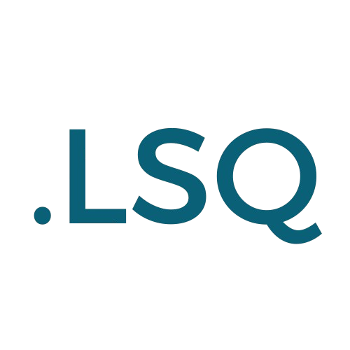

# LogiqScript: Uma Linguagem de Script Dinâmica e Extensível

Bem-vindo à LogiqScript! Uma linguagem de script interpretada, escrita em Python, projetada para ser simples, intuitiva e poderosa. Nascida como um exercício de criação de interpretadores, a LogiqScript evoluiu para uma ferramenta capaz de lidar com estruturas de dados complexas, manipulação de arquivos, automação de tarefas e até requisições web.

---

## ✨ Funcionalidades Principais

A LogiqScript suporta um conjunto robusto de funcionalidades modernas de programação:

* **Variáveis e Tipos:** Declaração simples com `let` e tipos de dados dinâmicos (números, strings).
* **Estruturas de Dados:** Suporte completo para `Listas` (arrays) e `Dicionários` (mapas/objetos).
* **Controle de Fluxo:** Estruturas condicionais com `if/else/end` e laços de repetição com `while/end`.
* **Funções:** Defina e chame suas próprias funções com `func`, parâmetros e valores de retorno com `return`.
* **Modularidade:** Reutilize código e organize seu projeto importando outros arquivos `.lqs` ou até mesmo módulos Python `.py` com a palavra-chave `import`.
* **Tratamento de Erros:** Lide com erros inesperados de forma graciosa usando blocos `try/catch/end`.
* **Classes e Funções Embutidas:** Um conjunto de ferramentas prontas para uso, incluindo:
    * **Funções:** `len()`, `type()`, `append()`, `to_string()`, `to_number()`.
    * **Classes para Automação e Web:**
        * `File()`: Para ler e escrever em arquivos locais.
        * `Https()`: Para fazer requisições web e consumir APIs.
        * `InputManager()`: Para controlar o mouse e o teclado, permitindo a automação de tarefas.

---

## 🚀 Como Começar

### Estrutura dos Arquivos

O projeto é composto pelos seguintes arquivos principais:
* `lexer.py`: O analisador léxico, que transforma o código-fonte em tokens.
* `interpreter.py`: O cérebro do projeto. Ele executa os tokens e dá vida à linguagem.
* `main.py`: O ponto de entrada que une tudo.
* `program.lqs`: O arquivo onde você escreve seu código LogiqScript.

### Executando um Script

1.  Escreva seu código no arquivo `program.lqs`.
2.  Abra um terminal na pasta raiz do projeto.
3.  Execute o interpretador com o seguinte comando:

```bash
python main.py
```
O resultado do seu script será exibido no terminal.

---

## 💻 Exemplo de Código

Este exemplo demonstra várias funcionalidades da LogiqScript, como fazer uma requisição web, analisar o resultado (JSON é tratado como um dicionário) e tomar decisões com base nos dados.

```logiqscript
# Faz uma requisição para uma API pública de piadas
let req = Https("[https://official-joke-api.appspot.com/random_joke](https://official-joke-api.appspot.com/random_joke)")

print "Status da requisição: " + to_string(req.status())

# Verifica se a requisição foi bem-sucedida
if req.status() == 200
    let piada = req.json()

    print "--- Piada do Dia ---"
    print piada["setup"]

    # (Idealmente, aqui teríamos uma função 'esperar(segundos)')
    
    print piada["punchline"]
else
    print "Não foi possível buscar a piada hoje :("
end

```

---

## 🎨 Syntax Highlighting no VS Code

Para uma experiência de desenvolvimento muito mais agradável, você pode instalar a extensão de syntax highlighting para a LogiqScript.

1.  **Empacote a extensão:** Navegue até a pasta da extensão (a que foi criada com `yo code`) e execute o comando `vsce package`. Isso criará um arquivo `.vsix`.
2.  **Instale no VS Code:**
    * Abra o VS Code.
    * Vá para a aba de Extensões.
    * Clique nos três pontinhos (`...`) e selecione **"Install from VSIX..."**.
    * Escolha o arquivo `.vsix` que você acabou de criar.
3.  Reinicie o VS Code e aproveite seu código LogiqScript lindamente colorido!
